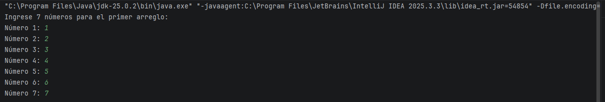
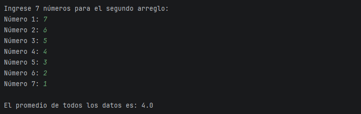
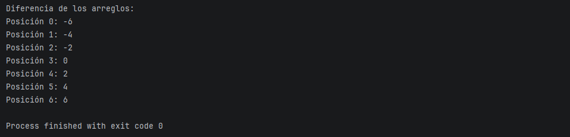

# Actividad Práctica 1 - Java

## Objetivo del proyecto
Desarrollar un programa en Java que utilice arreglos para almacenar números ingresados por el usuario, calcular la diferencia entre dos arreglos y mostrar el promedio de los datos.

## Descripción del programa
El programa realiza las siguientes acciones:

1. Solicita al usuario 7 números para el primer arreglo.
2. Solicita al usuario 7 números para el segundo arreglo.
3. Calcula un tercer arreglo con la diferencia de los dos anteriores.
4. Calcula el promedio de todos los números.
5. Muestra todos los valores del tercer arreglo.

## Instrucciones de ejecución

1. Clonar el repositorio

git clone https://github.com/Joseluis1316/Actividad-Practica-1-Java.git

2. Abrir el proyecto en IntelliJ IDEA.

3. Ejecutar el archivo:

Main.java

## Capturas de pantalla
Aquí se muestran capturas del programa ejecutándose.

## Contribuyentes
- José Luis Alzate Quiroz